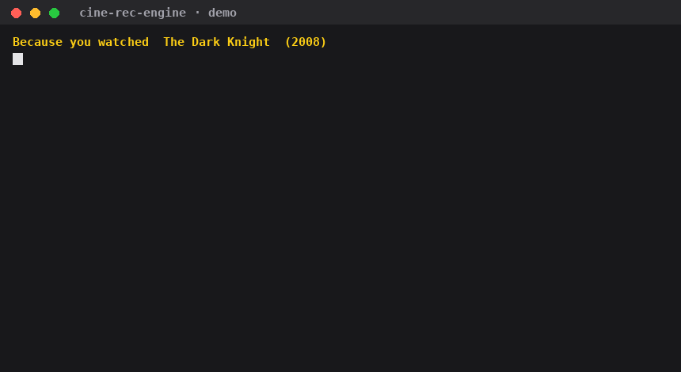

# Cine Rec Engine

[](https://github.com/DovBerKaplan/cine-rec-engine/actions/workflows/ci.yml)
[](LICENSE)
[](pyproject.toml)

> **Recommendations from your own database. No black-box API, no rented taste.**

**PostgreSQL in · ranked titles out · zero external calls on the hot path.**

**🖥️ [Try it in your browser — no install](https://dovberkaplan.github.io/cine-rec-engine/)** — every recommendation precomputed by the real engine, each row with its *why*, plus two user personas producing entirely different lists. Recommendations are picked from the bundled **830-title demo catalog**, not from all of TMDB — point the engine at your own mirror (ingest included) for the full catalog.



## Try it in 60 seconds — no API key

```bash
git clone https://github.com/DovBerKaplan/cine-rec-engine && cd cine-rec-engine/demo
docker compose up          # Postgres + 400 real titles + recommendations
```

That runs the full stack against a bundled 830-title demo catalog
(TMDB top-rated + their recommendation graphs, en-US, attribution
below) and prints, for The Dark Knight and Breaking Bad:

```
Because you watched  The Dark Knight  (2008)
  The Dark Knight Rises (2012)   why: same saga · same director
  The Batman (2022)              why: same style tags · shared keywords
  Memento (2000)                 why: same director · year window
```

A content-based recommendation engine for movies & series: give it one title
(or a user's whole watch history) and it returns similar titles, ranked by a
22-feature scorer whose weights were learned — not guessed.

```
   your data (TMDB mirror + user events)        what you get back
  ┌───────────────────────────────┐            ┌───────────────────────┐
  │ PostgreSQL                    │            │ ranked similar titles │
  │  · tmdb_media + satellites    │            │  · score + why        │
  │  · (optional) embeddings      │──engine──► │  · movies/series mix  │
  │  · (optional) TMDB rec cache  │            │  · per-user filtering │
  │  · your watch/rating events   │            │  · saga advancement   │
  └───────────────────────────────┘            └───────────────────────┘
```

## Quick start

```bash
pip install cine-rec-engine               # PyPI (or: pip install -e ".[pg,redis]")
psql -d yourdb -f docs/schema.sql         # the tables it expects
```

```python
import asyncpg
from cine_rec_engine import RecommendationService

pool = await asyncpg.create_pool("postgresql://user:pw@localhost/yourdb")
rec = RecommendationService()
await rec.initialize(pool)

# Similar to one title
results = await rec.find_similar(155)  # The Dark Knight → [Batman Begins, …]

# Or the titles a user loved (movies AND series, auto-balanced)
results = await rec.find_similar(
    tmdb_id=[155, 27205, 1396],   # Dark Knight, Inception, Breaking Bad
    limit=60,
    user_id=42,                   # filters watched titles, advances sagas
)
```

Each result carries its evidence — score, matched features, media type —
so your UI can explain *why* it recommended something.

## Why another recommender

| | Hosted rec APIs | Collaborative-filtering stacks | **Cine Rec Engine** |
|---|---|---|---|
| Works on day one (no user base) | ✅ | ❌ cold start | ✅ content-based |
| Your data stays yours | ❌ | ✅ | ✅ |
| Needs users' rating matrix | ❌ | ✅ | ❌ — metadata + your event table |
| Explainable per-title | partial | partial | ✅ 22 named features |
| Runs offline / on-prem | ❌ | ✅ | ✅ one Postgres |
| Embedding models included | — | — | ❌ **bring your own** (see below) |

The engine separates **recall** (SQL: genres, keywords, cast, crew,
companies, networks, collections, cached TMDB behavioral recs, optional
pgvector KNN) from **ranking** (a logistic scorer over 22 features with
published, fitted weights) from **models** (your embedding encoders —
deliberately not shipped).

## Measured against baselines

On the bundled 400-title demo pool with hand-curated adjacency judgments
(`eval/judgments.jsonl`, `eval/eval.py`):

| method | pairwise acc. | NDCG@10 |
|---|---|---|
| TMDB similar (behavioral graph) | 0.09 | 0.13 |
| cosine over overviews | 0.63 | 0.04 |
| **this engine (learned 22-feature scorer)** | **0.82** | **0.46** |

Honest caveats: the pool is small (830 titles, recommendation-closed,
with bundled MiniLM embeddings — `demo/data/`), recall runs in the same
same-medium mode the bot uses, and the judgments are one curator's.
Bring your own judgments file — the harness is in the repo.

## Feature highlights

- **Multi-seed blending** — one title or a thousand; per-seed weights;
  movie/series ratio follows the seed mix (90/10 cap so a minority is
  never silenced).
- **Saga-aware** — collection members chain: watched *Rocky I* → recommends
  *Rocky II*, not *Rocky I* again. Whole-saga watchers graduate out.
- **Per-user personalization** — `recommend_for_user()`: raw watch
  events → per-title weights (completion, series depth, recency,
  engagement) → a normalized user vector → an ANN recall channel through
  the same LTR scorer, with watched/rated/disliked hard-filtered.
  See `docs/personalization.md`.
- **Auteur recall** — director/writer/composer/DP channels with decay
  (someone's 8th film matters less than their 2nd).
- **Popularity guardrails** — vote floors per media type kill
  "high rating, 12 votes" noise; an action-popularity leak term keeps
  Marvel out of every list.
- **MMR diversification** — optional re-rank so one franchise doesn't
  take five consecutive slots.
- **Deterministic or noisy** — `randomness=0.0` is reproducible; dial it
  up for exploration without burying the top-3.
- **Degrades gracefully** — no embeddings? no TMDB rec cache? no Redis?
  Those channels switch off; the rest of the engine keeps working.

## The published weights

`cine_rec_engine/weights.json` — 22 features fitted with pairwise
logistic regression (6,650 training pairs). Opt in with
`CINE_REC_SCORER=learned`; features the artifact doesn't cover keep
their heuristic coefficients (partial application). A few, to set the
scale:

| Feature | Weight |
|---|---|
| `tmdb_rec_decay` (behavioral signal, rank-decayed) | 13.74 |
| `composer_match` | 5.54 |
| `cosine_sim` (overview embedding similarity) | 5.13 |
| `keyword_sim` | 4.35 |
| `writer_match` | 4.08 |
| `director_match` | 3.50 |
| `shared_collection` | 2.51 |
| `medium_mismatch` (movie↔tv penalty) | −0.52 |

Also in the repo: the evaluation harness and the demo judgments. Not
included: the larger labeled training sets the weights were fitted on and
the optional narrative-tag enrichment — the fitted coefficients
themselves are published in full.

## Feeding it data

Bring a local TMDB mirror — the built-in `ingest/` loader builds it from
TMDB's official daily ID exports (`python -m ingest.cli bootstrap`, then a
daily `refresh` off `/changes`; `en-US` only, adult-filtered, one API call
per title, upserts by key). The catalog schema splits movies and TV into
two fact tables with independent id spaces — exactly like TMDB — with
compatibility views serving the engine unchanged. `docs/data.md` has the
full contract. For user data, feed `user_watch_events` from your player
(`docs/personalization.md`) — or point `cine_rec_engine/watched.py` at
whatever events table you already have, one SQL string away.

## Repo layout

```
cine_rec_engine/    the engine (recall · scoring · ranking · weights)
ingest/             built-in TMDB mirror loader (bootstrap + daily refresh)
demo/               one-command demo: 400 bundled titles, no API key
eval/               pairwise/NDCG harness + the demo judgments
models/             embedding sidecar — YOUR encoders plug in here
docs/schema.sql     canonical split schema (movies | tv) + engine views
docs/user_data.sql  user layer: events, feedback, stats, vectors
docs/data.md        one-call ingest, filters, rate limits, acceptance rule
docs/personalization.md  w_i formulas, user vectors, recommend_for_user
examples/           runnable snippets
tests/              offline unit tests (no DB needed)
```

## Requirements & support

- Python ≥ 3.10, PostgreSQL ≥ 14, asyncpg
- Optional extras: `pip install ".[pg]"` (pgvector — KNN recall),
  `".[redis]"` (result + history caching), `TMDB_API_KEY` (behavioral
  rec sync), sentence-embedding encoders (KNN + cosine features)

## Performance

Measured on the synthetic 25k-title benchmark (`benchmarks/bench_e2e.py`,
PostgreSQL 16, 2-core container): **cold single-seed ≈ 45 ms · warm
(cache) 0.4 ms · 5-seed 322 ms**. The scorer runs ~37k (seed, candidate)
pairs/second/core with outputs within 1 float ULP of the reference
implementation (golden-vector tests). `benchmarks/bench_scoring.py`
reproduces the hot-loop number without any database.

## Roadmap

See [ROADMAP.md](ROADMAP.md) — history-based personalization is next.

## License

[MIT](LICENSE) — engine code and the fitted weights.
TMDB metadata itself is © TMDb — the engine never redistributes it.
